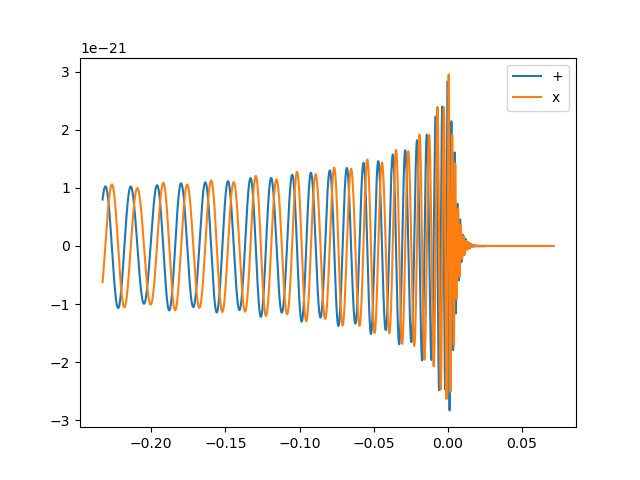

[](https://gwnrtools.github.io/nr-catalog-tools/)

# nr-catalog-tools

A stable, unified Python interface to public numerical-relativity (NR) binary black-hole
waveform catalogs, built to serve a broad range of gravitational-wave science:

- **LIGO-Virgo-KAGRA analyses** — reliable, PyCBC-compatible waveform and parameter access
  for parameter estimation, injection studies, and template bank construction
- **Waveform modeling** — consistent loading, physical scaling, and frame-alignment tools
  for calibrating and validating EOB, phenomenological, and surrogate models against any
  NR catalog
- **Cross-catalog studies** — tools to compare simulations across codes, including
  noise-weighted mismatch computation maximized over SO(3) rotations and BMS supertranslations

All three backends expose an identical interface so that analysis code written against one
catalog works against all others without modification.

**Supported catalogs:**

| Catalog | Code | Example simulation name |
|---------|------|------------------------|
| [SXS](https://data.black-holes.org/waveforms/catalog.html) | SpEC | `SXS:BBH:0001` |
| [RIT](https://ccrg.rit.edu/content/data/rit-waveform-catalog) | LazEv | `RIT:BBH:0001-n100-id3` |
| [MAYA / GT](https://einstein.gatech.edu/catalog/) | MayaKranc | `GT0001` |

---

## Installation

```bash
pip install nrcatalogtools
```

Dependencies: `sxs >= 2025.0.0`, `pycbc`, `lal`, `h5py`, `quaternionic`, `spherical`, `scipy`.
See [docs/index.md](docs/index.md#dependencies) for the full list.

---

## Quick Start

### Load a catalog

```python
import nrcatalogtools as nrcat

ritcat  = nrcat.RITCatalog.load()
sxscat  = nrcat.SXSCatalog.load(download=False)
mayacat = nrcat.MayaCatalog.load()
```

### Browse simulations

```python
print(ritcat.simulations_dataframe.index)
# Index(['RIT:BBH:0001-n100-id3', 'RIT:BBH:0002-n100-id0', ...], length=1879)
```

### Load a waveform

```python
wfm = ritcat.get("RIT:BBH:0003-n100-id0")
print(wfm.LM)     # available (ell, m) mode pairs
```

### Extract a single mode in physical units

```python
mode22 = wfm.get_mode(2, 2,
                      total_mass=60.0,   # M_sun
                      distance=100.0,    # Mpc
                      delta_t_seconds=1./4096)
```

### Get h₊ and h✕ polarizations

```python
pols = wfm.get_td_waveform(total_mass=40., distance=100.,
                            inclination=0.2, coa_phase=0.3)
hp, hc = pols.real(), -1 * pols.imag()
```

```python
import matplotlib.pyplot as plt
plt.plot(hp.sample_times, hp, label='h+')
plt.plot(hc.sample_times, hc, label='hx')
plt.legend(); plt.show()
```



### Get PyCBC-compatible source parameters

```python
params = ritcat.get_parameters("RIT:BBH:0001-n100-id3", total_mass=60.0)
# {'mass1': 30.0, 'mass2': 30.0, 'spin1x': 0.0, ..., 'f_lower': 23.4}
```

---

## Documentation

| Document | Description |
|----------|-------------|
| [docs/index.md](docs/index.md) | Full documentation hub and dependency list |
| [docs/catalogs.md](docs/catalogs.md) | Per-catalog reference: SXS, RIT, MAYA |
| [docs/waveform.md](docs/waveform.md) | `WaveformModes` API reference |
| [docs/architecture.md](docs/architecture.md) | Architectural overview and design decisions |
| [docs/package.md](docs/package.md) | Detailed package internals |
| [docs/goal.md](docs/goal.md) | Scientific motivation and mismatch formalism |

---

## Building the docs locally

```bash
# Install the package with docs extras
pip install -e ".[docs]"

# Serve with live reload at http://127.0.0.1:8000
mkdocs serve

# Or produce a static build in site/
mkdocs build
```

The docs site is deployed automatically from `master` via GitHub Actions whenever
files under `docs/`, `mkdocs.yml`, `nrcatalogtools/`, or `pyproject.toml` change.

---

## License

See [LICENSE](LICENSE).
